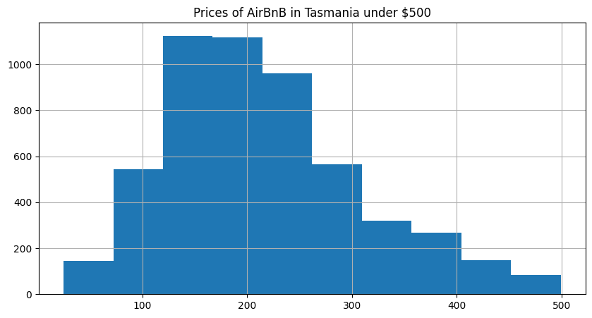

TODO: Reflect on what you learned this week and what is still unclear.

This week we talked about Pandas. I struggled a little at the start but manage to figure it out after installing the necessary programs. I also learnt multiple new commands that I am still unfamiliar with but I hope to familiarize myself with it in the next few weeks.

Below are new findings on my dataset:

From the histogram above, we can see that most AirBnBs in Tasmania are priced from $100 to $300, with only a small percentage of AirBnBs priced over $500. This provides us an insight on the range of prices of AirBnBs in Tasmania.

I have also applied my dataset to the 'basic_pandas.ipynb' file and analyzed the results although not all the codes were running successfully so I still have to work that out.